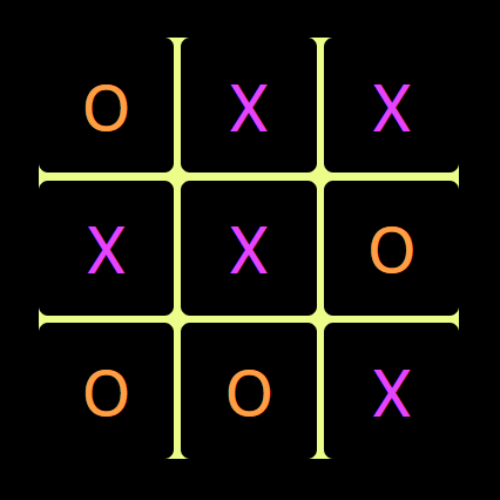

<h1>Tic-Tac-Toe Game - </h1>

Tic Tac Toe is a classic two-player game, also known as Noughts and Crosses. It is played on a 3x3 grid where each player takes turns marking a cell in the grid with their symbol—one player uses 'X' and the other uses 'O'. The objective is to be the first player to get three of their symbols in a row, either horizontally, vertically, or diagonally.

 
<a href="https://pritikabansal.github.io/simon-game-color/"> Click here for live demo</a>
